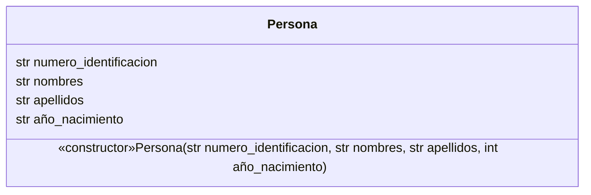

# Ejercicio 2.1 (p.63)
## Diagrama de Clases


```py
class Persona:
    def __init__(self, numero_identificacion: str, nombres: str, apellidos: str, año_nacimiento: int):
        self.numero_identificacion = numero_identificacion
        self.nombres = nombres
        self.apellidos = apellidos
        self.año_nacimiento = año_nacimiento
        
    def imprimir(self):
        for key, val in self.__dict__.items():
            print(f"{key}: {val}")

if __name__ == "__main__":
    persona = Persona("12345", "John", "Doe", 2004)
    persona.imprimir()
```