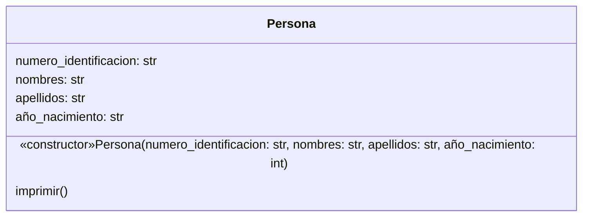
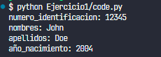
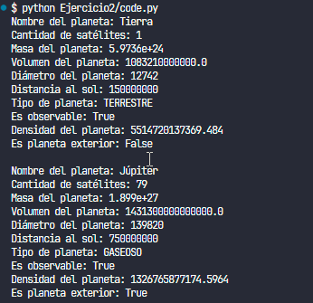
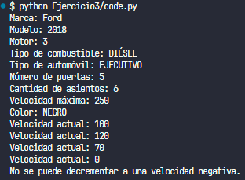
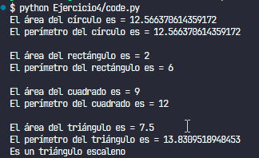
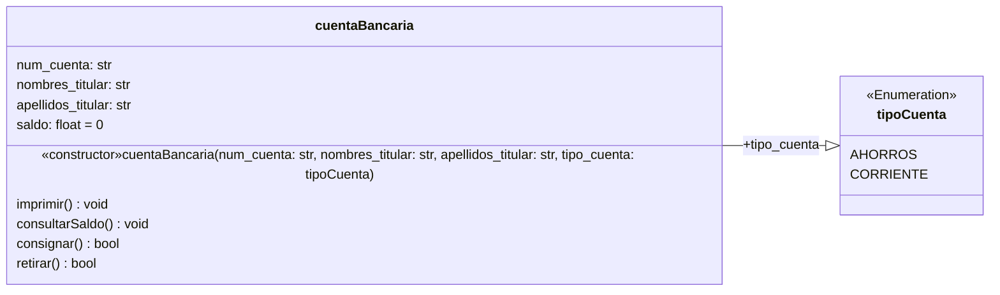
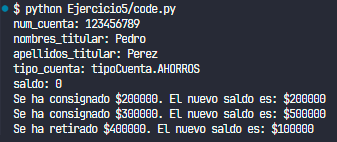

## Ejercicio 2.1 (p.63)

### Diagrama de Clases



#### Implementación en código (Python)

```py
class Persona:
    def __init__(self, numero_identificacion: str, nombres: str, apellidos: str, año_nacimiento: int):
        self.numero_identificacion = numero_identificacion
        self.nombres = nombres
        self.apellidos = apellidos
        self.año_nacimiento = año_nacimiento
        
    def imprimir(self):
        for key, val in self.__dict__.items():
            print(f"{key}: {val}")

if __name__ == "__main__":
    persona = Persona("12345", "John", "Doe", 2004)
    persona.imprimir()
```

##### Ejecución



## Ejercicio 2.2 (p.66)

### Diagrama de Clases


#### Implementación en código (Python)

```py
from enum import Enum

class Tipo(Enum):
    GASEOSO = "GASEOSO"
    TERRESTRE = "TERRESTRE"
    ENANO = "ENANO"

class Planeta:
    nombre = None
    cantidad_satelites = 0
    masa = 0
    volumen = 0
    diametro = 0
    distancia = 0
    observable = False

    def __init__(self, nombre, cantidad_satelites, masa, volumen, diametro, distancia, tipo, observable):
        self.nombre = nombre
        self.cantidad_satelites = cantidad_satelites
        self.masa = masa
        self.volumen = volumen
        self.diametro = diametro
        self.distancia = distancia
        self.tipo = tipo
        self.observable = observable

    def imprimir(self):
        print(f"Nombre del planeta: {self.nombre}")
        print(f"Cantidad de satélites: {self.cantidad_satelites}")
        print(f"Masa del planeta: {self.masa}")
        print(f"Volumen del planeta: {self.volumen}")
        print(f"Diámetro del planeta: {self.diametro}")
        print(f"Distancia al sol: {self.distancia}")
        print(f"Tipo de planeta: {self.tipo.value}")
        print(f"Es observable: {self.observable}")

    def calcular_densidad(self):
        return self.masa/self.volumen

    def exterior(self):
        limite = 149597870 * 3.4
        if self.distancia > limite:
            return True
        else:
            return False

planeta1 = Planeta("Tierra", 1, 5.9736E24, 1.08321E12, 12742, 150000000, Tipo.TERRESTRE, True)
planeta1.imprimir()
print(f"Densidad del planeta: {planeta1.calcular_densidad()}")
print(f"Es planeta exterior: {planeta1.exterior()}")

print()

planeta2 = Planeta("Júpiter", 79, 1.899E27, 1.4313E15, 139820, 750000000, Tipo.GASEOSO, True)
planeta2.imprimir()
print(f"Densidad del planeta: {planeta2.calcular_densidad()}")
print(f"Es planeta exterior: {planeta2.exterior()}")
```

##### Ejecución



## Ejercicio 2.3 (p.74)

### Diagrama de Clases


#### Implementación en código (Python)

```py
from enum import Enum

class Combustible(Enum):
    GASOLINA = "GASOLINA"
    BIOETANOL = "BIOETANOL"
    DIESEL = "DIÉSEL"
    BIODIESEL = "BIODIÉSEL"
    GAS_NATURAL = "GAS NATURAL"

class Tipo(Enum):
    CARRO_CIUDAD = "CARRO DE CIUDAD"
    SUBCOMPACTO = "SUBCOMPACTO"
    COMPACTO = "COMPACTO"
    FAMILIAR = "FAMILIAR"
    EJECUTIVO = "EJECUTIVO"
    SUV = "SUV"

class Color(Enum):
    BLANCO = "BLANCO"
    NEGRO = "NEGRO"
    ROJO = "ROJO"
    NARANJA = "NARANJA"
    AMARILLO = "AMARILLO"
    VERDE = "VERDE"
    AZUL = "AZUL"
    VIOLETA = "VIOLETA"

class Automovil:

    def _init_(self, marca, modelo, motor, tipo_combustible, tipo_automovil, puertas, asientos, velocidad_max, color):
        self.marca = marca
        self.modelo = modelo
        self.motor = motor
        self.tipo_combustible = tipo_combustible
        self.tipo_automovil = tipo_automovil
        self.puertas = puertas
        self.asientos = asientos
        self.velocidad_max = velocidad_max
        self.color = color
        self.velocidad_actual = 0

    def get_marca(self):
        return self.marca

    def get_modelo(self):
        return self.modelo

    def get_motor(self):
        return self.motor

    def get_tipo_combustible(self):
        return self.tipo_combustible

    def get_tipo_automovil(self):
        return self.tipo_automovil

    def get_puertas(self):
        return self.puertas

    def get_asientos(self):
        return self.asientos

    def get_velocidad_max(self):
        return self.velocidad_max

    def get_color(self):
        return self.color

    def get_velocidad_actual(self):
        return self.velocidad_actual

    def set_marca(self, marca):
        self.marca = marca

    def set_modelo(self, modelo):
        self.modelo = modelo

    def set_motor(self, motor):
        self.motor = motor

    def set_tipo_combustible(self, tipo_combustible):
        self.tipo_combustible = tipo_combustible

    def set_tipo_automovil(self, tipo_automovil):
        self.tipo_automovil = tipo_automovil

    def set_puertas(self, puertas):
        self.puertas = puertas

    def set_asientos(self, asientos):
        self.asientos = asientos

    def set_velocidad_max(self, velocidad_max):
        self.velocidad_max = velocidad_max

    def set_color(self, color):
        self.color = color

    def set_velocidad_actual(self, velocidad_actual):
        self.velocidad_actual = velocidad_actual

    def acelerar(self, incremento_velocidad):
        if self.velocidad_actual + incremento_velocidad < self.velocidad_max:
            self.velocidad_actual = self.velocidad_actual + incremento_velocidad
        else:
            print("No se puede incrementar a una velocidad superior a la máxima del automóvil")

    def desacelerar(self, decremento_velocidad):
        if self.velocidad_actual - decremento_velocidad > 0:
            self.velocidad_actual = self.velocidad_actual - decremento_velocidad
        else:
            print("No se puede decrementar a una velocidad negativa.")

    def frenar(self):
        self.velocidad_actual = 0

    def tiempo_llegada(self, distancia):
        return distancia/self.velocidad_actual

    def imprimir(self):
        print(f"Marca: {self.marca}")
        print(f"Modelo: {self.modelo}")
        print(f"Motor: {self.motor}")
        print(f"Tipo de combustible: {self.tipo_combustible.value}")
        print(f"Tipo de automóvil: {self.tipo_automovil.value}")
        print(f"Número de puertas: {self.puertas}")
        print(f"Cantidad de asientos: {self.asientos}")
        print(f"Velocidad máxima: {self.velocidad_max}")
        print(f"Color: {self.color.value}")

auto_1 = Automovil("Ford", 2018, 3, Combustible.DIESEL, Tipo.EJECUTIVO, 5, 6, 250, Color.NEGRO)
auto_1.imprimir()
auto_1.set_velocidad_actual(100)
print(f"Velocidad actual: {auto_1.get_velocidad_actual()}")
auto_1.acelerar(20)
print(f"Velocidad actual: {auto_1.get_velocidad_actual()}")
auto_1.desacelerar(50)
print(f"Velocidad actual: {auto_1.get_velocidad_actual()}")
auto_1.frenar()
print(f"Velocidad actual: {auto_1.get_velocidad_actual()}")
auto_1.desacelerar(20)
```
##### Ejecución 



## Ejercicio 2.4 (p.86)

### Diagrama de Clases


#### Implementación en código (Python)

```py
import math

class Circulo:

    def __init__(self, radio):
        self.radio = radio

    def calcular_area(self):
        return math.pi * math.pow(self.radio, 2)

    def calcular_perimetro(self):
        return 2 * math.pi * self.radio

class Rectangulo:

    def __init__(self, base, altura):
        self.base = base
        self.altura = altura

    def calcular_area(self):
        return self.base * self.altura

    def calcular_perimetro(self):
        return (2 * self.base) + (2 * self.altura)

class Cuadrado:

    def __init__(self, lado):
        self.lado = lado

    def calcular_area(self):
        return self.lado * self.lado

    def calcular_perimetro(self):
        return 4 * self.lado

class TrianguloRectangulo:

    def __init__(self, base, altura):
        self.base = base
        self.altura = altura

    def calcular_area(self):
        return self.base * self.altura / 2

    def calcular_perimetro(self):
        return self.base + self.altura + self.calcular_hipotenusa()

    def calcular_hipotenusa(self):
        return math.pow(self.base * self.base + self.altura * self.altura, 0.5)

    def tipo_triangulo(self):
        if self.base == self.altura and self.base == self.calcular_hipotenusa() and self.altura == self.calcular_hipotenusa():
            print("Es un triángulo equilátero")
        elif self.base != self.altura and self.base != self.calcular_hipotenusa() and self.altura != self.calcular_hipotenusa():
            print("Es un triángulo escaleno")
        else:
            print("Es un triángulo isósceles")

class PruebaFiguras:

    def __init__(self):
        self.circulo = Circulo(2)
        self.rectangulo = Rectangulo(1,2)
        self.cuadrado = Cuadrado(3)
        self.triangulo_rectangulo = TrianguloRectangulo(3,5)

    def ejecucion(self):
        print(f"El área del círculo es = {self.circulo.calcular_area()}")
        print(f"El perímetro del círculo es = {self.circulo.calcular_perimetro()}")
        print()
        print(f"El área del rectángulo es = {self.rectangulo.calcular_area()}")
        print(f"El perímetro del rectángulo es = {self.rectangulo.calcular_perimetro()}")
        print()
        print(f"El área del cuadrado es = {self.cuadrado.calcular_area()}")
        print(f"El perímetro del cuadrado es = {self.cuadrado.calcular_perimetro()}")
        print()
        print(f"El área del triángulo es = {self.triangulo_rectangulo.calcular_area()}")
        print(f"El perímetro del triángulo es = {self.triangulo_rectangulo.calcular_perimetro()}")
        self.triangulo_rectangulo.tipo_triangulo()

if __name__ == "__main__":
    prueba = PruebaFiguras()
    prueba.ejecucion()
```
##### Ejecución



## Ejercicio 2.5 (p.95)

### Diagrama de Clases



#### Implementación en código (Python)

```py
from enum import Enum, auto

class tipoCuenta(Enum):
    AHORROS = auto()
    CORRIENTE = auto()

class cuentaBancaria:
    def __init__(self, num_cuenta: int, nombres_titular: str, apellidos_titular: str, tipo_cuenta: tipoCuenta):
        self.num_cuenta = num_cuenta
        self.nombres_titular = nombres_titular
        self.apellidos_titular = apellidos_titular
        self.tipo_cuenta = tipo_cuenta
        self.saldo = 0
        
    def imprimir(self):
        for key, val in self.__dict__.items():
            print(f"{key}: {val}")
            
    def consultarSaldo(self):
        print(f"El saldo actual es: ${self.saldo}")
        
    def consignar(self, cantidad: float):
        if cantidad > 0:
            self.saldo += cantidad
            print(f"Se ha consignado ${cantidad}. El nuevo saldo es: ${self.saldo}")
            return True
        else:
            print("El valor a consignar debe ser mayor a cero.")
            return False
    
    def retirar(self, cantidad: float):
        if cantidad > 0 and cantidad <= self.saldo:
            self.saldo -= cantidad
            print(f"Se ha retirado ${cantidad}. El nuevo saldo es: ${self.saldo}")
            return True
        else:
            print("El valor a retirar debe ser mayor a cero y menor o igual al saldo actual.")
            return False

if __name__ == "__main__":
    cuenta_bancaria = cuentaBancaria(123456789, "Pedro", "Perez", tipoCuenta.AHORROS)
    cuenta_bancaria.imprimir()
    cuenta_bancaria.consignar(200000)
    cuenta_bancaria.consignar(300000)
    cuenta_bancaria.retirar(400000)
```

##### Ejecución

